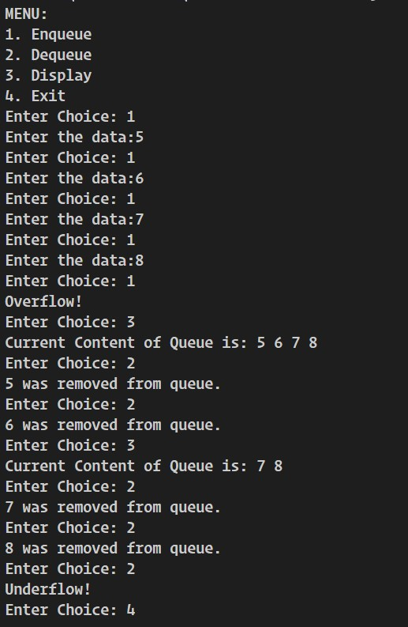
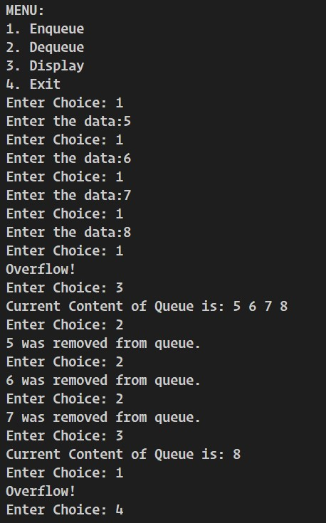
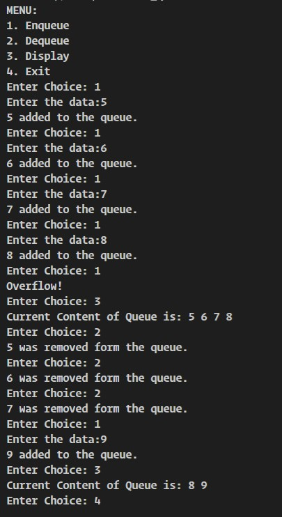

# **QUEUE**
## **Linear Queue**
### **Introduction**
A queue is logically a **First In First Out (FIFO)** linear data structure. It is a
homogeneous collection of elements in which new elements are added at one end called **rear**, and
the existing elements are deleted from other end called **front**.

### **Operations in Queue:**
* ### **Enqueue:**
    Enqueue operation will insert (add) an element to queue, at the rear end.

    
    **Algorithm:**  
    Let **queue** be the arrays of some specified size say **size**. **rear** and **front** are the two points for element insertion and deletion and let them both be initialized to -1 at beginning.

    1.	If rear >=size-1:  
             i. Display "Queue Overflow".  
             ii. Exit

    2.	Else:  
        Input the value to be inserted and assign to variable data.
    3.  If front=-1 and rear=-1:  
                   &emsp; front=front+1
    4.	rear=rear+1
    5.	queue[rear]=data
    6.	Exit

* ### **Dequeue:**
    Dequeue operation will delete (remove) an element from the queue from the front end
    and will assign the deleted value to a variable.
    

    **Algorithm:**
    Let **queue** be the arrays of some specified size say **size**. **rear** and **front** are the two points for element insertion and deletion and let them both be initialized to -1 at beginning.

    1.	If rear=-1 and front=-1:  
             i. Display "Queue Underflow".  
             ii. Exit

    2.	Else:  
        data=queue[front]
    3.  If front= rear:  
             front=rear=-1
    4.  Else:  
             front=front+1
    5.	Display data
    6.	Exit
 
  ### **Implementation in C++**:

  You can get the source code in the link. [Source Code](./linear_queue.cpp).  

  **Demo Input Output**:

   

   ### Problem with Linear Queue:

   As seen in demo snap below, linear queue is in overflow condition even when there is only one item in the queue of size 4.

    

    Such problem can be resolved with circular queue.
## **Circular Queue**

### **Operations in Circular Queue:**
* ### **Enqueue:**
    Enqueue operation will insert (add) an element to  circular queue, at the rear end.

    
    **Algorithm:**  
    Let **queue** be the arrays of some specified size say **size**. **rear** and **front** are the two points for element insertion and deletion and let them both be initialized to -1 at beginning.

    1.	If (rear+1)%size ==front:  
             i. Display "Queue Overflow".  
             ii. Exit

    2.	Else:  
        Input the value to be inserted and assign to variable data.
    3.  If front=-1 and rear=-1:  
                   &emsp; front=front+1
    4.	rear=(rear+1)%size
    5.	queue[rear]=data
    6.	Exit

* ### **Dequeue:**
    Dequeue operation will delete (remove) an element from the circular queue from the front end and will assign the deleted value to a variable.
    

    **Algorithm:**
    Let **queue** be the arrays of some specified size say **size**. **rear** and **front** are the two points for element insertion and deletion and let them both be initialized to -1 at beginning.

    1.	If rear=-1 and front=-1:  
             i. Display "Queue Underflow".  
             ii. Exit

    2.	Else:  
        data=queue[front]
    3.  If front= rear:  
             front=rear=-1
    4.  Else:  
             front=(front+1)%size
    5.	Display data
    6.	Exit
 
  ### **Implementation in C++**:

  You can get the source code in the link. [Source Code](./circular_queue.cpp).  

  **Demo Input Output**:

    The same sample input which gave some error in case of linear queue works just fine in case of circular queue, and gives overflow condition only when the queue is full.
   

