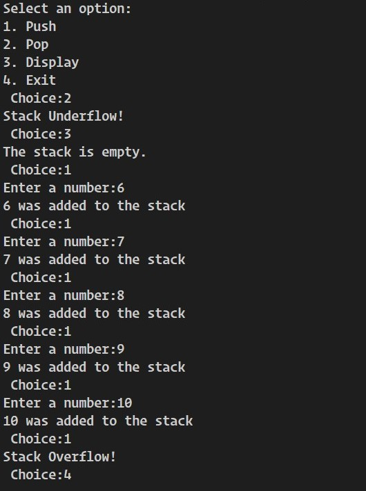
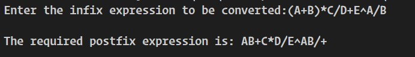

# **STACK**
### **Introduction**

A Stack is an ordered collection of items into which new items may be inserted and from which items may be deleted at only one end, called the top of the stack. It is the linear data structure which follows the **Last In First Out (LIFO)** approach.

### **Operations in Stack:**
* ### **Push:**
  When an item is inserted into the stack, the operation is called push operation. The condition when an attempt is made to push an item into a full stack is known as _"Overflow"_.  
    
    **Algorithm:**
    1.	Check if the stack is full.
    2.	If the stack is full, warn about Overflow Condition and exit.
    3.	If the stack is not full, increase the top pointer by one.
    4.	Push the data item to the top of stack.
    5.	Exit

* ### **Pop:**
    When an item is removed from the stack, the operation is called pop operation.	The condition when an attempt is made to pop an item from an empty stack is known as _"Underflow"_.  

    **Algorithm:**
    1.	Check if the stack is empty.
    2.	If the stack is empty, warn about Underflow Condition and exit.
    3.	If the stack is not empty, remove item on top of stack and display it.
    4.	Decrease the top pointer by one.
    5.	Exit
 
  ### **Implementation in C++**:

  You can get the source code in the link. [Source Code](./stack.cpp).  

  **Demo Input Output**:

   

### **Applications of Stack:**  
 * ### **Infix to Postfix Conversion**  
    The **infix** notation is what we come across in our general mathematics, where the operator is written
in-between the operands.  
 **For example**, the expression to add two numbers A and B is written in infix
notation as: **A+B**  
    * **Operator Precedence:**
  
      _Exponential (^ or $):_ ------------- Highest precedence  

      _Multiplication/Division (*, /):_ ---- Next precedence

      _Addition/Subtraction (+, -):_ ------ Least precedence

   In the **postfix** notation the operator(s) are written after the operands, so it is called the postfix notation.  
 The above expression
if written in postfix expression looks like: **AB+**  
In a postfix expression operands appear before the operator, so there is no need for operator precedence and other rules
   #### **Algorithm of Infix to Postfix Conversion**
   1. Enclose the infix expression with a parenthesis"()".
   2. Read the infix expression form left to right.
   3. If opening parenthesis is encountered, push it to the stack.
   4. If an operand is encountered, append it to the postfix expression.
   5. If an operator is encountered, pop the operators in the stack which has equal or higher precedence than that of the read operator and append it to the postfix expression. Then finally push the read operator to the stack.
   6. If a closed parenthesis is encountered, pop the operators in the stack and append to the postfix expression until an opening parenthesis is encountered. Pop that opening parenthesis as well without appending it to the expression.
   7. Repeat until all symbols from infix expression are read.

    ### **Implementation in C++**:

    You can get the source code in the link. [Source Code](./infixtopostfix.cpp)  

    **Demo Input Output**:

    

